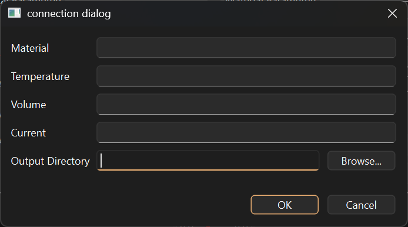
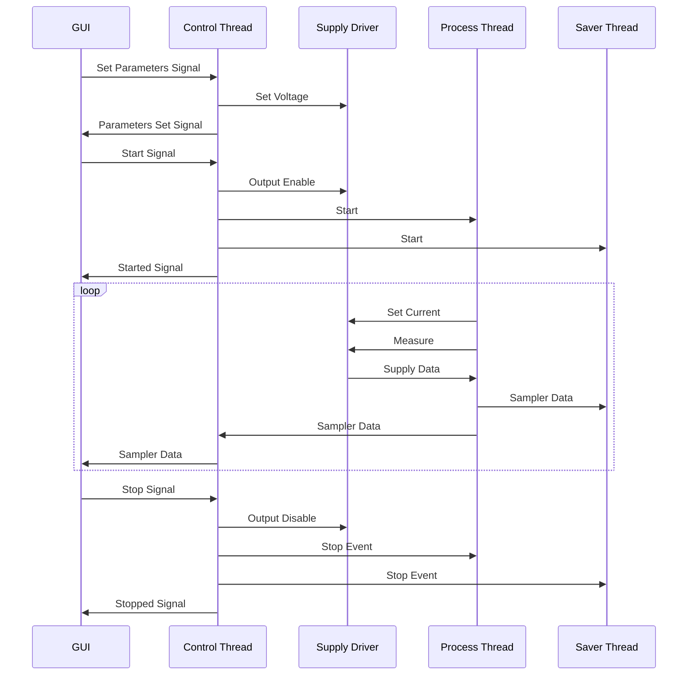
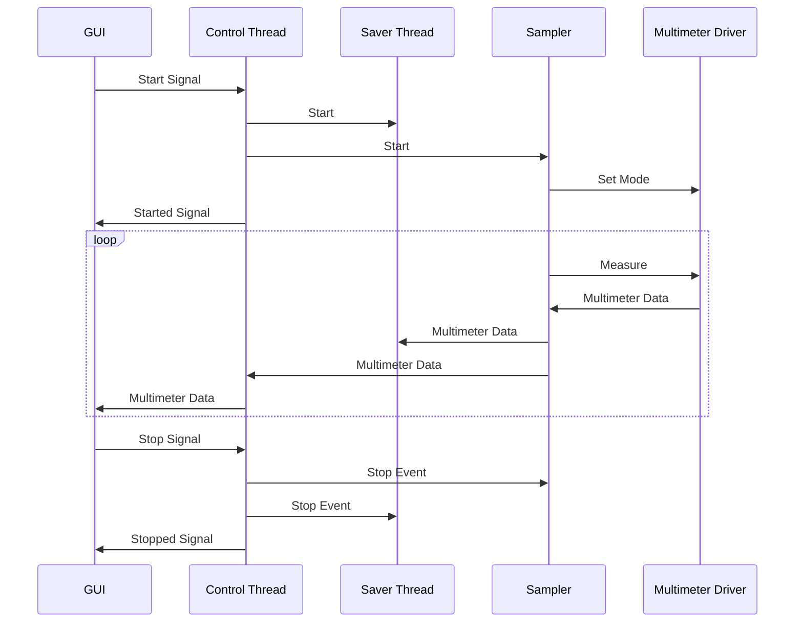

# flash-v2

This software is meant for use in corona discharge or materials processing experiments. It provides GUI tools for controlling AC/DC power supplies and for collecting data from a multimeter.

# Installation
Regardless of the installation method, NI-VISA is needed to interface with the instruments.

## As Windows executable
Download the zip file for the desired version from the releases section of the GitHub page. Unzip it to somewhere you will remember. In the destination folder, there will be a `flash-v2.exe` file and a folder called `_internal`. Double click `flash-v2.exe` to run the program. Ignore and do not tamper with `_internal` - it contains necessary internal libraries.

## As Python project
This software is open source and so may be used from source. The [uv](https://docs.astral.sh/uv/) package/project manager is used to manage dependencies. Clone this repository, then cd into `flash-v2/` and run:

```sh
uv run main.py
```
For information on bundling into an executable, see [Packaging](#packaging).
# Usage
Upon launching this program, you will be greeted by the following menu:


To run a tool, click on the corresponding button. Multiple tools can run at once, and the application will not exit until all windows have been closed.

## AC/DC power supplies

The interfaces for the AC and DC power supply tools are very similar.


To run an experiment:

1. Click the connect button. A dialog will open and prompt for experiment details and a data output directory. The experiment details are not required, but strongly recommended. They will be incorporated into the file name. Press OK to connect to the power supply.


1. Input the experiment parameters. The available parameters are explained [here](#parameters).

1. Click apply to synchronize experiment parameters with the power supply and internal state.

1. Click start to begin the experiment. Data will begin populating the graphs and will be saved to disk every ten seconds.

1. If any parameters need to be updated while the experiment is running, change the necessary parameters then press apply.

1. Press stop to stop the experiment. Power supply output will immediately be disabled.

If at any point the flash control window is closed, the experiment will automatically conclude.

### Parameters

| Parameter             | Function                                                               | Notes                                                       |
|-----------------------|------------------------------------------------------------------------|-------------------------------------------------------------|
| Sample Rate           | Interval in milliseconds between measurements                          |                                                             |
| E-field               | E-field in V/cm to be applied to the sample                            | The sample height is used to determine the voltage to apply |
| Frequency (AC only)   | Power supply output frequency in Hz                                    |                                                             |
| Current Density       | Whether current density is to be ramped up or held constant            | Current density is calculated using sample diameter         |
| Current Density Start | The initial current density in A/cm²                                   | Current density is calculated using sample diameter         |
| Current Density End   | If ramping, the target current density in A/cm²                        | Current density is calculated using sample diameter         |
| Current Density Rate  | If ramping, the rate at which to change the current density in A/cm²/s | Current density is calculated using sample diameter         |
| Height                | Height of the sample in cm                                             | Used to calculate E-field                                   |
| Diameter              | Diameter of the sample in cm                                           | Used to calculate current density                           |
| Pulse Enable          | Check to enable pulsed output                                          |                                                             |
| Pulse Period          | Period of the pulse in milliseconds                                    |                                                             |
| Duty Cycle            | Duty cycle of the pulse by percentage.                                 |                                                             |

## Multimeter


# Architecture
## Flash


## Multimeter


## Packaging
```sh
uv run pyinstaller --windowed --name flash-v2 main.py
```