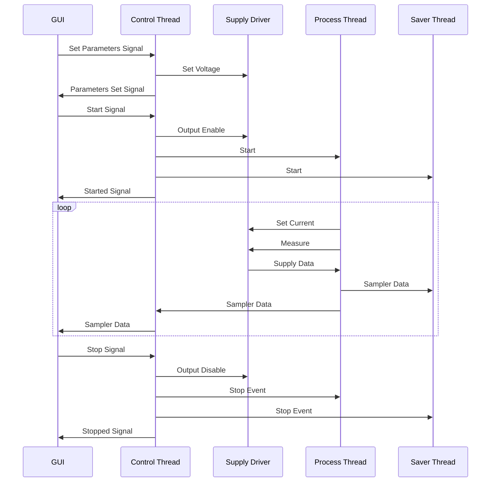
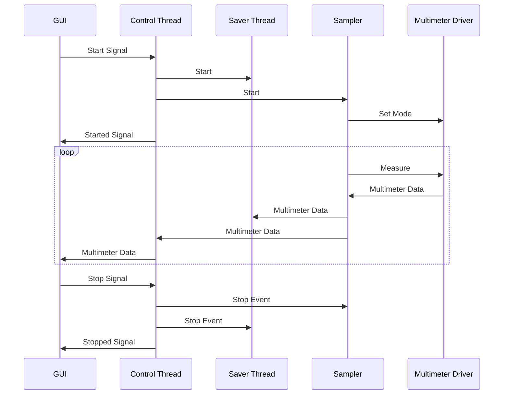

# flash-v2

## Flash


```mermaid
sequenceDiagram
    participant G as GUI
    participant C as Control Thread
    participant D as Supply Driver
    participant P as Process Thread
    participant S as Saver Thread

    G->>C: Set Parameters Signal
    C->>D: Set Voltage
    C->>G: Parameters Set Signal
    G->>C: Start Signal
    C->>D: Output Enable
    C->>P: Start
    C->>S: Start
    C->>G: Started Signal

    loop
        P->>D: Set Current
        P->>D: Measure
        D->>P: Supply Data
        P->>S: Sampler Data
        P->>C: Sampler Data
        C->>G: Sampler Data
    end

    G->>C: Stop Signal
    C->>D: Output Disable
    C->>P: Stop Event
    C->>S: Stop Event
    C->>G: Stopped Signal
```
## Multimeter

```mermaid
sequenceDiagram
    participant G as GUI
    participant C as Control Thread
    participant S as Saver Thread
    participant P as Sampler
    participant D as Multimeter Driver

    G->>C: Start Signal
    C->>S: Start
    C->>P: Start
    P->>D: Set Mode

    C->>G: Started Signal

    loop
        P->>D: Measure
        D->>P: Multimeter Data
        P->>S: Multimeter Data
        P->>C: Multimeter Data
        C->>G: Multimeter Data
    end

    G->>C: Stop Signal
    C->>P: Stop Event
    C->>S: Stop Event
    C->>G: Stopped Signal
```

## Packaging
```sh
uv run pyinstaller --windowed --name flash-v2 main.py
```