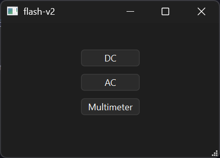
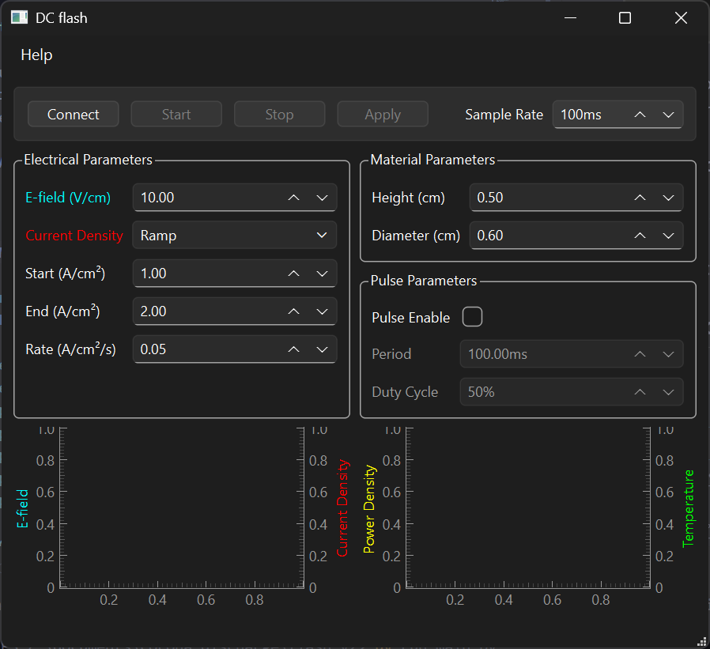
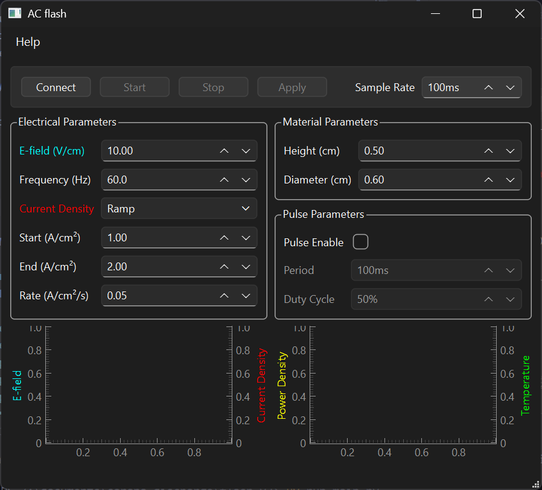
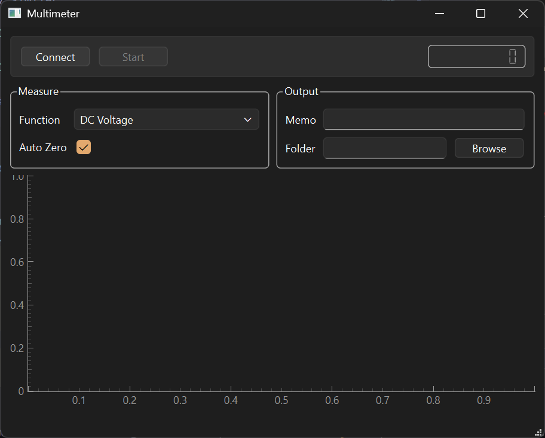
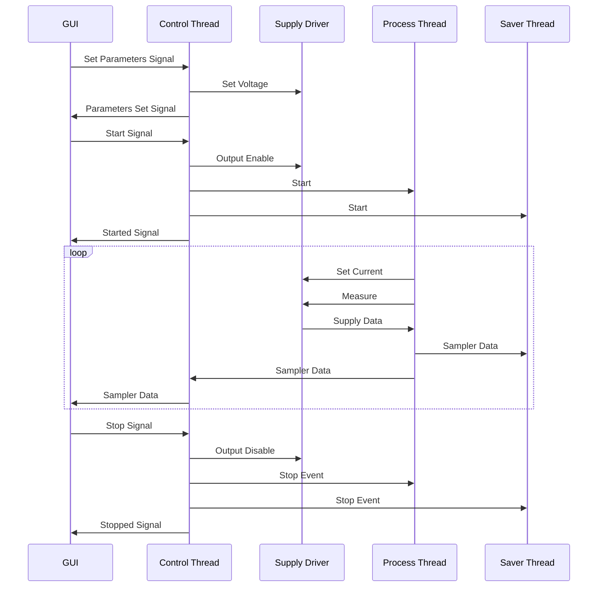
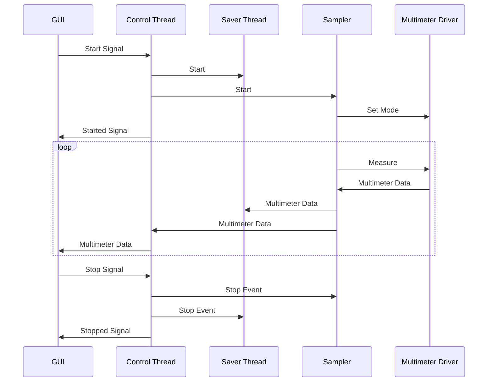

# flash-v2

This software is meant for use in corona discharge or materials processing experiments. It provides GUI tools for controlling AC/DC power supplies and for collecting data from a multimeter.

## Installation
Regardless of the installation method, NI-VISA is needed to interface with the instruments.

### As Windows executable
Download the zip file for the desired version from the releases section of the GitHub page. Unzip it to somewhere you will remember. In the destination folder, there will be a `flash-v2.exe` file and a folder called `_internal`. Double click `flash-v2.exe` to run the program. Ignore and do not tamper with `_internal` - it contains necessary internal libraries.

### As Python project
This software is open source and so may be used from source. The [uv](https://docs.astral.sh/uv/) package/project manager is used to manage dependencies. Clone this repository, then cd into `flash-v2/` and run:

```sh
uv run main.py
```
For information on bundling into an executable, see [Packaging](#packaging).
## Usage
Upon launching this program, you will be greeted by the following menu:



To run a tool, click on the corresponding button. Multiple tools can run at once, and the application will not exit until all windows have been closed.

### AC/DC power supplies

The interfaces for the AC and DC power supply tools are very similar.





### Multimeter



## Architecture
### Flash


### Multimeter


## Packaging
```sh
uv run pyinstaller --windowed --name flash-v2 main.py
```